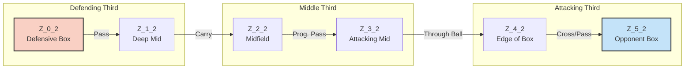
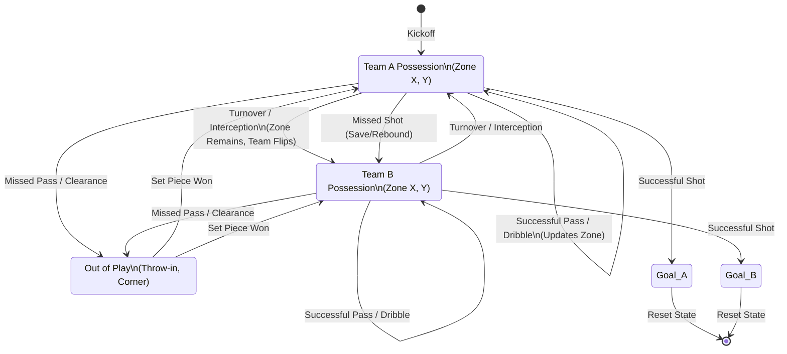

# Design Document: Player-Augmented MCMC Soccer Simulation

## 1. System Overview
This document outlines the architecture for a highly granular, state-space Markov Chain Monte Carlo (MCMC) simulation for football (soccer) matches. Unlike traditional team-level Poisson models, this simulation models the game at the **possession and spatial level**, heavily augmented by player-specific physical attributes and manager tactical data.

---

## 2. Data Architecture & Sources

To achieve a fine-grained simulation without overfitting, the model decouples baseline spatial probabilities from player-specific modifiers using three distinct data sources.

### Data Sources
1.  **StatsBomb Open Data (Event Data):** Used strictly to calculate the baseline spatial physics of football (e.g., historical probabilities of passes succeeding between specific zones).
2.  **FBref / Opta (Aggregate Data):** Used to inject individual player skill (e.g., Kevin De Bruyne's progressive passing, Erling Haaland's shot conversion).
3.  **FIFA/EA FC & Football Manager (Proxy Data):** Used to inject physical and tactical context (e.g., Team pace during counter-attacks, Manager directness).

### Diagram: Data Flow Architecture
```mermaid
flowchart TD
    subgraph Data Sources
        SB[StatsBomb Event Data\n(x,y coordinates, events)] 
        FB[FBref Player Stats\n(xG, xA, Prog Passes)] 
        FM[FIFA/FM Data\n(Pace, Stamina, Tactics)] 
    end

    subgraph Matrix Engine
        TM(Base Transition Matrix\n30x30 Spatial Grid)
        MM(Modified Matrix Engine)
    end

    SB -->|Historical spatial frequencies| TM
    TM --> MM
    FB -->|Player skill multipliers| MM
    FM -->|Context/Physical multipliers| MM

    subgraph Runtime
        MC[MCMC Simulation Loop]
    end

    MM -->|Calculates dynamic probabilities| MC
    MC -->|Stochastic State Transition| MC
```

---

## 3. State Space Definition

The match is modeled as a sequence of discrete states. A state $S$ at time $t$ is defined by a tuple:
$S_t = (Team\_in\_Possession, Ball\_Location\_Zone, Game\_Phase)$

### The 30-Zone Grid
The pitch is divided into a 6 (Length) x 5 (Width) grid, creating 30 distinct zones ($Z_{0,0}$ to $Z_{5,4}$). 
*   **X-Axis (0 to 5):** 0 is the team's own penalty area; 5 is the opponent's penalty area.
*   **Y-Axis (0 to 4):** 0 is the left wing; 4 is the right wing.

### Diagram: Spatial State Progression (Central Pitch View)


---

## 4. State Transitions

The core of the simulation is calculating the probability of transitioning from $S_t$ to $S_{t+1}$. 

### The Modifier Equation
The probability of moving to any specific next state is calculated dynamically during the simulation loop using the following modifier equation:

$$P(NextState) = Normalize \left[ P_{base} \times (1 + M_{player}) \times (1 + M_{tactics}) \times (1 + M_{physical}) \right]$$

### The Markov Chain Transition Flow
At any given moment, the team in possession can transition to a new zone, lose the ball, shoot, or the ball goes out of play.

### Diagram: State Transition Machine


## 5. Implementation Roadmap
1.  **Grid Mapping:** Map StatsBomb `(x,y)` coordinates to the 6x5 grid.
2.  **Base Matrix Calculation:** Compute the raw transition probabilities (e.g., $P(Z_{4,2} | Z_{3,2})$) for all 30 zones.
3.  **Modifier Tuning:** Develop bounding functions to ensure multipliers (e.g., Pace, Manager Directness) do not inflate probabilities past 1.0 before normalization.
4.  **Simulation Loop:** Write the Monte Carlo loop to simulate 100,000 matches, sampling from the dynamically adjusted probability distributions.
